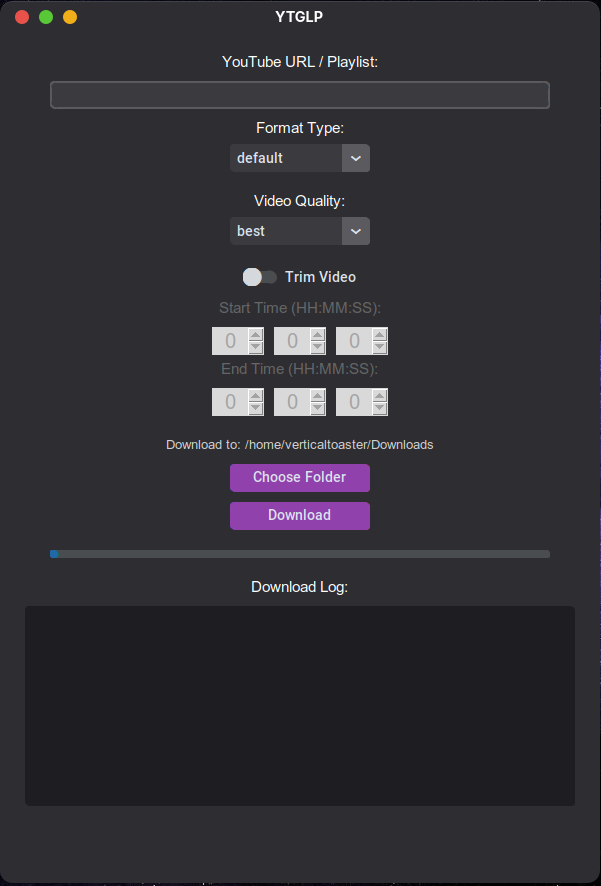

# YTGLP

A simple and sleek Python GUI frontend for yt-dlp that lets you download YouTube videos with optional trimming and format conversion

Made this originally for usage with soundpad but ended up adding more features leading to a fully working application

 

Make sure to install yt-dlp beforehand to get it to work

on windows, open powershell and type "winget install yt-dlp", it will install ffmpeg and yt-dlp both
on macos, you can use brew : brew install yt-dlp
on linux, use whatever package manager is available,

you can either build using the build script or download from the release section directly
